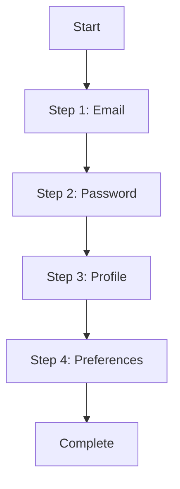
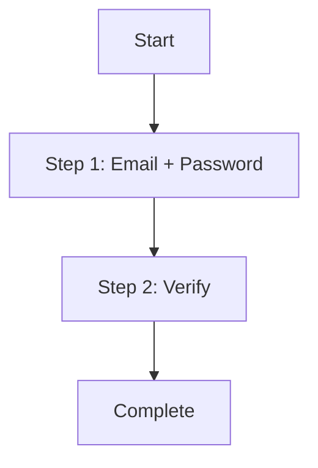

# Flow Analysis Skill

Analyze and compare multiple user journeys, identify optimization opportunities, and provide conversion-focused recommendations.

## When to Use

- Compare different flow versions
- Analyze competitor flows
- Identify conversion bottlenecks
- Optimize onboarding sequences
- Reduce cart abandonment
- Improve signup completion rates

## Capabilities

1. **Multi-flow comparison** - Compare A/B variants or competitors
2. **Conversion analysis** - Identify drop-off points
3. **Friction mapping** - Visualize user journey friction
4. **Benchmark comparison** - Against best practices
5. **Optimization recommendations** - Data-driven suggestions

## Flow Types Supported

| Flow | Key Metrics | Common Issues |
|------|-------------|---------------|
| Signup | Completion rate, time | Too many fields, unclear value |
| Login | Success rate, errors | Password requirements, 2FA friction |
| Checkout | Conversion, abandonment | Guest checkout, payment trust |
| Onboarding | Completion, skip rate | Too long, no progress indicator |
| Search | Results quality, filters | No results, poor relevance |

## Workflow

### Phase 1: Flow Mapping

Document each flow:
- Entry points
- Required steps
- Optional steps
- Decision points
- Exit points
- Success criteria

### Phase 2: Execution & Measurement

For each step, capture:
- Time to complete
- Error rate
- Friction score (1-5)
- User actions required
- System responses
- Screenshots

### Phase 3: Friction Analysis

Evaluate each step:

| Factor | Score 1-5 | Description |
|--------|-----------|-------------|
| Discoverability | [X] | Can users find next action? |
| Clarity | [X] | Are instructions clear? |
| Efficiency | [X] | Minimum steps possible? |
| Error handling | [X] | Are errors recoverable? |
| Feedback | [X] | Is progress communicated? |

### Phase 4: Comparative Analysis

Compare flows side-by-side:
- Step count
- Time required
- Error opportunities
- Mobile friendliness
- Accessibility

### Phase 5: Optimization Recommendations

Prioritize by:
- Impact on conversion
- Implementation effort
- Risk level
- User segment affected

## Output Format

```markdown
# Flow Analysis Report

**Flows Analyzed**: [List]
**Date**: [Date]
**Application Type**: [Type]

## Executive Summary

| Flow | Steps | Time | Friction Score | Completion % |
|------|-------|------|----------------|--------------|
| Signup v1 | 5 | 2m 30s | 2.8 | 65% |
| Signup v2 | 3 | 1m 15s | 1.9 | 82% |

**Recommendation**: [Key finding]

## Flow Comparison

### Signup Flow Analysis

#### Version 1 (Current)



**Metrics**:
- Steps: 5
- Avg time: 2m 30s
- Friction score: 2.8
- Drop-off points: Step 3 (32%)

#### Version 2 (Proposed)



**Metrics**:
- Steps: 3
- Avg time: 1m 15s
- Friction score: 1.9
- Expected improvement: +17% completion

## Step-by-Step Comparison

| Step | V1 | V2 | Improvement |
|------|----|----|-------------|
| Fields to complete | 8 | 4 | -50% |
| Required clicks | 12 | 6 | -50% |
| Error opportunities | 5 | 2 | -60% |
| Validation feedback | Delayed | Real-time | +Quality |

## Friction Map

### V1 Friction Points

| Step | Friction | Issue | Impact |
|------|----------|-------|--------|
| Step 3 | 4.2 | Profile photo required | 32% drop-off |
| Step 4 | 3.8 | Too many preferences | 18% drop-off |

### V2 Improvements

| Issue | Solution | Expected Impact |
|-------|----------|-----------------|
| Profile photo | Make optional | +15% completion |
| Preferences | Move to later | +10% completion |

## Best Practice Comparison

| Practice | V1 | V2 | Best Practice |
|----------|----|----|---------------|
| Social login | No | Yes | Yes |
| Progress indicator | No | Yes | Yes |
| Password visibility | No | Yes | Yes |
| Inline validation | No | Yes | Yes |
| Guest option | N/A | N/A | Depends |

## Drop-off Analysis

### Where Users Abandon

| Point | V1 % | V2 % | Improvement |
|-------|------|------|-------------|
| Start → Step 1 | 15% | 10% | +5% |
| Step 1 → Step 2 | 12% | 8% | +4% |
| Step 2 → Complete | 8% | 5% | +3% |
| **Total Drop-off** | **35%** | **23%** | **+12%** |

## Optimization Recommendations

### High Impact, Low Effort
1. **Add social login** - Expected +8% completion
2. **Real-time validation** - Expected +5% completion
3. **Progress indicator** - Expected +3% completion

### High Impact, Higher Effort
1. **Reduce required fields** - Expected +12% completion
2. **Progressive profiling** - Expected +10% completion

### A/B Test Suggestions

1. **Test: Social login prominence**
   - A: Social buttons below email form
   - B: Social buttons above email form
   - Metric: Click rate, completion rate

2. **Test: Field count**
   - A: All fields on one page
   - B: Multi-step with 2 fields each
   - Metric: Completion rate, time to complete

## Competitive Benchmark

| Metric | Our Site | Competitor A | Competitor B | Best |
|--------|----------|--------------|--------------|------|
| Signup steps | 5 | 3 | 4 | 3 |
| Time to complete | 2m 30s | 1m 00s | 1m 45s | 1m |
| Social options | 0 | 3 | 2 | 3+ |
| Guest checkout | No | Yes | Yes | Yes |

## Implementation Roadmap

### Week 1
- [ ] Add progress indicator
- [ ] Enable password visibility toggle

### Week 2
- [ ] Implement real-time validation
- [ ] Add social login (Google)

### Week 3
- [ ] A/B test field reduction
- [ ] Implement progressive profiling
```

## Example Usage

```
Use the flow-analysis skill to:
1. Analyze current signup flow
2. Compare against competitor [URL]
3. Identify top 3 optimization opportunities
4. Estimate conversion impact
```

## Best Practices

1. **Map before optimizing** - Understand current state
2. **Measure everything** - Data over assumptions
3. **Test incrementally** - One change at a time
4. **Consider segments** - Mobile vs desktop, new vs returning
5. **Balance speed and quality** - Don't sacrifice trust for speed
